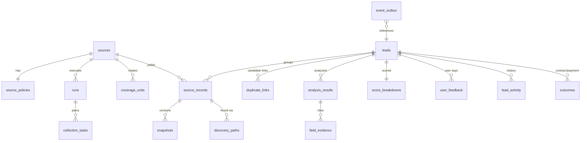

# 아키텍처

## 1. 구성

```
┌──────────── Windows 설치 앱 (Tauri 2, NSIS, 사용자별 설치) ────────────┐
│  WebView2: React 화면 (desktop/src)                                    │
│    └─ LivePort ──HTTP+Bearer──┐   ┌─ Tauri 명령 backend_connection     │
│                               │   │   (주소·토큰 전달, 셸 권한 없음)   │
│  Rust 셸 (desktop/src-tauri) ─┼───┘                                    │
│    └─ sidecar 실행·감시·재시작·종료                                     │
│         │ stdout 준비 줄 {"event":"ready","port","token"}             │
│         ▼                                                              │
│  Python 백엔드 (PyInstaller 단일 exe, backend/worklead)                 │
│    FastAPI(127.0.0.1:임의 포트) · 워커 스레드 · 스케줄러 · SQLite(WAL)   │
└────────────────────────────────────────────────────────────────────────┘
      사용자 데이터: %LOCALAPPDATA%\Worklead\ (DB · 로그 · 백업 · 내보내기)
```

- 백엔드는 `--sidecar` 로 실행되어 stdin 이 닫히면(셸 종료) 스스로 끝난다. 셸도 종료 시 자식을 죽인다.
- 같은 데이터 폴더에는 백엔드가 하나만 뜬다 (파일 잠금). 셸은 single-instance 플러그인으로 창을 하나만 연다.
- 토큰은 실행마다 새로 만들고 stdout 파이프로만 셸에 전달한다. 로그·명령행·URL 에 넣지 않는다.

## 2. 백엔드 모듈

| 경로 | 역할 |
| --- | --- |
| `api/app.py`, `api/schemas.py` | `/v1` 라우트, 보안 미들웨어(Host·Origin·토큰), 오류 형식, SSE. 스키마가 곧 계약(OpenAPI 생성원) |
| `engine/http.py`, `engine/robots.py` | 공통 HTTP 실행기: 허용 호스트, robots.txt(RFC 9309), 호스트별 일일 예산, 간격, 차단 판별, 재시도 없음 |
| `engine/runs.py` | 영속 작업 큐: 멱등 키, 임대·heartbeat, 만료 복구, 일시정지·재개·취소 |
| `engine/executors.py` | 실행기: 신규 탐색(전국 순환), 재확인, 수동 입력, 내보내기, 재분석 |
| `engine/pipeline.py` | 정규화 → 중복 → 규칙(+선택 AI) 분석 → 저장 → 이벤트 |
| `engine/worker.py` | 수집 워커 1 + 대화형 워커 1 + 스케줄러 (같은 프로세스 스레드) |
| `engine/events.py` | outbox, 알림 규칙(설정·조용한 시간·중복 방지), 보존 정리 |
| `analysis/*` | 규칙 분류(축별 독립·근거 구간), 보수·날짜 해석, 위험 신호, 점수, 적격성, 수익성, 초안, AI 제공자 인터페이스 |
| `sources/*` | 어댑터 계약, 조사 프로필 기반 사이트 어댑터, 당근 프로필(잠김), 수동 입력 |
| `services/*` | 목록 조회(대기열·필터·커서), 직렬화, 설정, 지표, 데모 시드 |
| `storage.py` | 마이그레이션(사전 백업·실패 복구), 온라인 백업, 무결성 확인 복원 |

## 3. 수집 흐름과 전국 순환

```
스케줄러(앱 실행 중) ─▶ runs(queued) ─▶ 수집 워커가 임대
  plan_discovery(): 조사로 확인된 지역×검색어 → CoverageUnit
  주기(scan_cycle) 결정: 모든 단위가 완료되면 다음 주기
  작업 생성: task_key = source|query_group|region|cursor|cycle (중복 생성 불가)
  공정 순환: 마지막 방문이 가장 오래된 단위부터, 실행당 최대 60개
  이전 실행에서 남은 같은 주기 작업은 새 실행이 이어받음
  작업마다: discover → 상세(최근 12시간 내 확인한 공고는 요청 생략, 발견 경로만 기록)
            → parse → ingest(중복 키: 원천 ID > 정규화 URL > 내용 해시)
  결과 분류: 정상 / 빈 결과(결과 없음 표시 확인) / 파싱 실패 / 요청 실패 / 정책 정지
```

- 401·403·CAPTCHA·robots 금지 → **소스 정지**(사용자 해제 전 자동 실행 없음). 기존 리드 상태는 바꾸지 않는다.
- 429·예산 소진·robots 확인 불가 → **이번 실행만 중단**, Retry-After 를 스케줄러가 존중.
- 네트워크·5xx → 같은 실행에서 재시도하지 않고 다음 실행 대상으로 남김.
- Coverage: 계획 단위·완료·대기·실패·차단, 마지막 방문·다음 차례, 깊이 제한, 오늘 예산, 한 바퀴 예상 일수(추정). **시장 포괄률은 항상 unknown**. 지역 목록 전체성 미확인이거나 17개 시·도 중 일부만 있으면 부분 탐색으로 표시.
- 놓친 예약은 현재 구간 1회로만 보충한다 (멱등 키 `sched:<source>:<kind>:<bucket>`).

## 4. 데이터 모델 (ERD 요약)



추가 표: `host_budgets`(호스트별 일일 예산), `robots_cache`, `user_profile`(버전), `app_settings`. 마이그레이션: `backend/worklead/migrations/versions/0001_initial_schema.py`.

원칙: 상태 축(source/access/analysis/sales)을 합치지 않는다 · 모르는 값은 NULL · 금액은 최소 통화 단위 정수 · 사용자 판단(user_mark, memo, sales_stage, feedback)은 자동 판정과 분리되어 재수집·재분석이 덮어쓰지 않는다 · 비슷한 글은 병합하지 않고 후보 관계로만 연결한다.

## 5. 분석

- 축별 독립 규칙: `demand_intent`, `engagement_type`, `work_mode`, `collaboration_mode`, `applicant_scope`. 각 판정은 원문 인용·위치·근거 유형(explicit/inferred/user_confirmed)·신뢰 수준·규칙 버전을 남긴다.
- 우선순위(0–100): 업무 30 · 구매 의도 25 · 원격 20 · 최신성 15 · 범위 명확성 10 − 위험 감점. 근거 없는 요소는 `null`(미평가)로 두고 재정규화하지 않는다. 수주 확률이 아니다.
- 적격성이 점수보다 우선: 마감·판매자 홍보·출근 필수·정규직·위험 신호 → 제외, 재택·모집·외주 여부가 불명확하면 확인 필요, 모두 충족해야 추천.
- 수익성: 건 단위 예산이 있을 때만 시나리오 계산. 시급·월급은 환산하지 않음. 예산이 없으면 기여액 null + 견적 가설(목표 시간가치 설정 시).
- AI: `AnalysisProvider` 인터페이스. 현재 실제 제공자 없음(NullProvider) → `rules_only`. 캐시 키 = 원문 해시+엔진+규칙/프롬프트+프로필 버전(+내 확인). 실패는 `failed` 로 기록하고 같은 입력으로 자동 재요청하지 않는다.

## 6. 화면 (desktop/src)

- `data/port.ts`: 화면이 필요로 하는 기능 목록. `LivePort`(계약 클라이언트) / `MockPort`(데모 시나리오). 데모와 실제 데이터를 섞지 않고, 연결 실패 시 데모로 바꾸지 않는다.
- `data/live/mapper.ts`: 계약(snake_case) → 화면 모델(camelCase). 계약 변경은 타입 오류로 드러난다.
- 목록은 읽는 동안 순서를 바꾸지 않는다: 변경은 해당 행만 갱신, 새 리드는 배너로 알린 뒤 사용자가 반영.
- 자세한 화면 설계는 `docs/DESIGN.md`.
